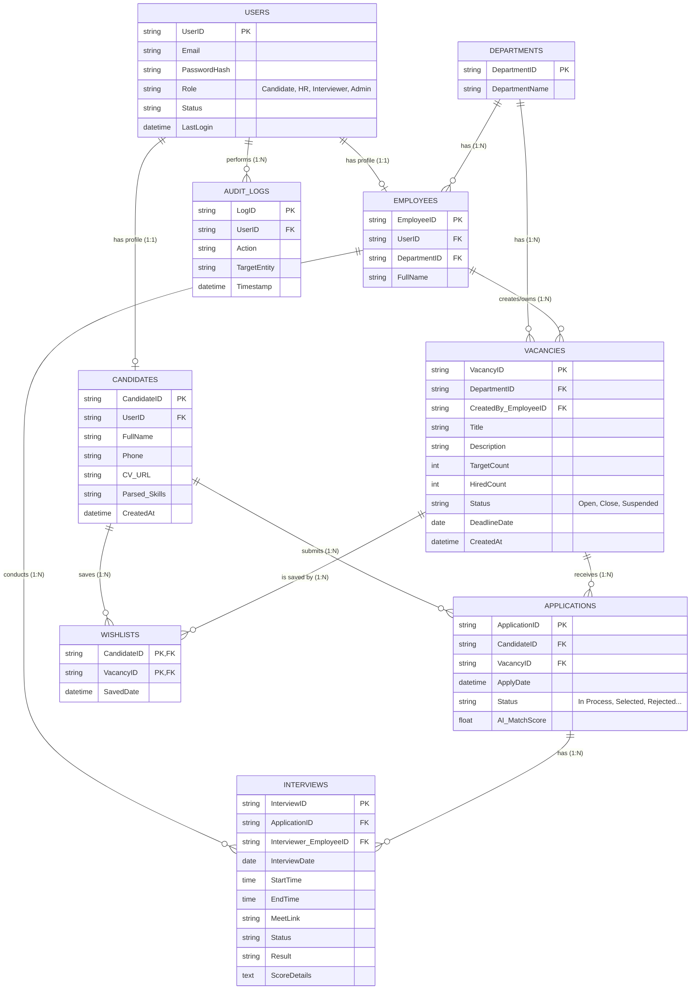

```mermaid 
erDiagram
    USERS ||--o| EMPLOYEES : "has profile (1:1)"
    USERS ||--o| CANDIDATES : "has profile (1:1)"
    USERS ||--o{ AUDIT_LOGS : "performs (1:N)"

    DEPARTMENTS ||--o{ EMPLOYEES : "has (1:N)"
    DEPARTMENTS ||--o{ VACANCIES : "has (1:N)"

    EMPLOYEES ||--o{ VACANCIES : "creates/owns (1:N)"
    EMPLOYEES ||--o{ INTERVIEWS : "conducts (1:N)"

    CANDIDATES ||--o{ APPLICATIONS : "submits (1:N)"
    CANDIDATES ||--o{ WISHLISTS : "saves (1:N)"

    VACANCIES ||--o{ APPLICATIONS : "receives (1:N)"
    VACANCIES ||--o{ WISHLISTS : "is saved by (1:N)"

    APPLICATIONS ||--o{ INTERVIEWS : "has (1:N)"

    USERS {
        string UserID PK
        string Email
        string PasswordHash
        string Role "Candidate, HR, Interviewer, Admin"
        string Status
        datetime LastLogin
    }

    DEPARTMENTS {
        string DepartmentID PK
        string DepartmentName
    }

    EMPLOYEES {
        string EmployeeID PK
        string UserID FK
        string DepartmentID FK
        string FullName
    }

    CANDIDATES {
        string CandidateID PK
        string UserID FK
        string FullName
        string Phone
        string CV_URL
        string Parsed_Skills
        datetime CreatedAt
    }

    VACANCIES {
        string VacancyID PK
        string DepartmentID FK
        string CreatedBy_EmployeeID FK
        string Title
        string Description
        int TargetCount
        int HiredCount
        string Status "Open, Close, Suspended"
        date DeadlineDate
        datetime CreatedAt
    }

    APPLICATIONS {
        string ApplicationID PK
        string CandidateID FK
        string VacancyID FK
        datetime ApplyDate
        string Status "In Process, Selected, Rejected..."
        float AI_MatchScore
    }

    INTERVIEWS {
        string InterviewID PK
        string ApplicationID FK
        string Interviewer_EmployeeID FK
        date InterviewDate
        time StartTime
        time EndTime
        string MeetLink
        string Status
        string Result
        text ScoreDetails
    }

    WISHLISTS {
        string CandidateID PK, FK
        string VacancyID PK, FK
        datetime SavedDate
    }

    AUDIT_LOGS {
        string LogID PK
        string UserID FK
        string Action
        string TargetEntity
        datetime Timestamp
    }
```
